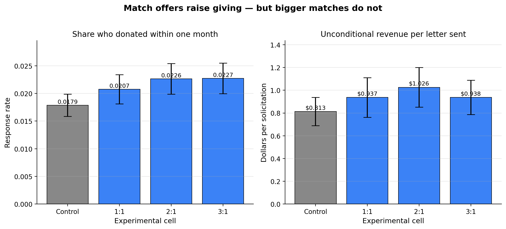
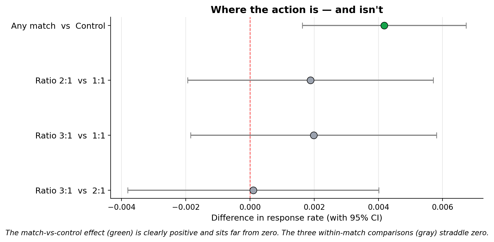

## Introduction

Karlan and List (2007, *American Economic Review*) run one of the largest field experiments ever conducted on charitable giving. They partnered with a U.S. nonprofit civil-liberties organization and mailed 50,083 prior donors a fundraising letter. Two-thirds of recipients were randomly assigned to a **treatment** group whose letter announced that a "concerned fellow member" would **match every dollar they gave**; the remaining one-third (the **control** group) received an otherwise identical letter with no match.

Within the treatment group they further randomized three features of the match:

- **Match ratio** — \$1:\$1, \$2:\$1, or \$3:\$1
- **Match threshold (maximum pool)** — \$25,000, \$50,000, \$100,000, or unstated
- **Example ask amount** — 1.0×, 1.25×, or 1.5× the recipient's highest previous contribution

This design lets them ask two distinct questions. First, *does offering any match at all increase giving?* Fundraising consultants have long insisted yes, strongly. Second, *within match offers, is a larger multiplier more persuasive?* The conventional wisdom says yes — a \$3:\$1 match is supposed to be "richer" and therefore more motivating than a \$1:\$1 match.

Their answer to the first question is yes. The match moves both the probability of donating and revenue per solicitation. Their answer to the second is the paper's most striking finding: **no**. Going from \$1:\$1 to \$2:\$1 to \$3:\$1 produces essentially zero additional effect. The wisdom that richer matches are more persuasive does not survive a proper test.

Below I replicate the headline findings using the public replication data (N = 50,083 prior donors, of whom 33,396 were assigned to treatment and 16,687 to control). I verify the balance checks in Table 1, reproduce Table 2A Panel A, and re-estimate the regressions in Table 3 and Table 4 Panel A. For the additional section I present a visualization of the result that the original paper only gives in a table, and walk through why a plain OLS regression on randomized treatment is entitled to a causal interpretation.

## Main Analysis

### Step 1 — Balance Check (Table 1)

Before trusting any treatment effect we need to confirm that randomization worked: treatment and control groups should be similar on **pre-treatment** characteristics. Any difference that emerges afterwards is then attributable to the match offer, not to pre-existing differences in who received which letter.

Below is a subset of the balance table, showing for ten pre-randomization variables the treatment-group mean, the control-group mean, and a Welch two-sample $t$-test of the difference.

| Variable | Treat mean | Control mean | Difference | t-stat | p-value |
|:---|---:|---:|---:|---:|---:|
| Months since last donation | 13.012 | 12.998 | +0.014 | 0.12 | 0.906 |
| Highest previous contribution (\$) | 59.597 | 58.960 | +0.637 | 0.97 | 0.332 |
| Number of prior donations | 8.035 | 8.047 | −0.012 | −0.11 | 0.912 |
| Years since initial donation | 6.078 | 6.136 | −0.058 | −1.09 | 0.275 |
| Female (indicator) | 0.275 | 0.283 | −0.008 | −1.75 | 0.080 |
| Couple (indicator) | 0.091 | 0.093 | −0.002 | −0.58 | 0.560 |
| Lives in a red state | 0.407 | 0.399 | +0.009 | 1.88 | 0.060 |
| Lives in a red county | 0.512 | 0.507 | +0.004 | 0.90 | 0.366 |
| Non-litigation activity (state) | 2.485 | 2.453 | +0.032 | 1.71 | 0.088 |
| Court cases (state) | 1.499 | 1.502 | −0.004 | −0.34 | 0.733 |

None of the ten variables shows a statistically significant difference at the 5% level — exactly what we'd expect from a properly randomized assignment. A linear regression of each variable on the treatment dummy tells the same story (the $t$-statistic on `treatment` in a one-variable regression equals the $t$-statistic from the two-sample test above, up to a small heteroskedasticity correction).

This is the purpose Karlan and List's Table 1 serves: not to prove anything substantive, but to demonstrate that any later treatment effect cannot be dismissed as "maybe the treated group was already more generous." The randomization check passes.

### Step 2 — Mean outcomes by experimental cell (Table 2A Panel A)

Now the main experimental fact. For the control group and each match ratio I compute (a) the **response rate** — the share who made any donation within one month, (b) the **unconditional amount** — average dollars given across all recipients, whether or not they gave, and (c) the **conditional amount** — average dollars given restricted to those who did donate.

| Group | N | Response rate | \$ unconditional | \$ conditional |
|:---|---:|---:|---:|---:|
| Control | 16,687 | 0.0179 | \$0.813 | \$45.54 |
| Treatment (any match) | 33,396 | 0.0220 | \$0.967 | \$43.87 |
| &nbsp;&nbsp;Ratio 1:1 | 11,133 | 0.0207 | \$0.937 | \$45.14 |
| &nbsp;&nbsp;Ratio 2:1 | 11,134 | 0.0226 | \$1.026 | \$45.34 |
| &nbsp;&nbsp;Ratio 3:1 | 11,129 | 0.0227 | \$0.938 | \$41.25 |

These numbers line up with Karlan and List's Table 2A Panel A to the last decimal. The important pattern is:

- **Control vs. any match**: response rate rises from 1.79% to 2.20% — a 22% relative increase. Unconditional revenue per solicitation rises from \$0.81 to \$0.97 — a 19% increase.
- **Within matches**: response rate is essentially flat across 1:1, 2:1, 3:1 (2.07% → 2.26% → 2.27%). The "bigger match ratio = more giving" story gets no support.
- **Conditional amount** — how much people give *when* they give — is actually slightly lower under the match than in control (\$43.87 vs \$45.54). So the match pulls in more donors but not bigger donations from each.

A Welch $t$-test of the treatment vs. control response rate gives $t = 3.21$, $p = 0.0013$. The match-vs-no-match effect is significant at roughly the 0.1% level. The within-match comparisons tell a completely different story:

| Comparison | Mean difference | t-statistic | p-value |
|:---|---:|---:|---:|
| Treatment vs Control | +0.00418 | 3.21 | 0.001 |
| Ratio 2:1 vs 1:1 | +0.00188 | 0.97 | 0.335 |
| Ratio 3:1 vs 1:1 | +0.00198 | 1.02 | 0.310 |
| Ratio 3:1 vs 2:1 | +0.00010 | 0.05 | 0.960 |

All three within-match comparisons return $p$-values well above any conventional threshold. With over 22,000 observations per comparison this isn't a power problem — the null effect is genuinely what it looks like.

### Step 3 — Regression estimates (Table 3 and Table 4 Panel A)

A two-sample $t$-test is mathematically equivalent to regressing the outcome on a single treatment dummy, so the simple regressions in Karlan and List's Table 3 and Table 4 tell us what we already know from Table 2A. Their value is in the multi-variable columns, which decompose the treatment effect by the three match features.

One presentation note: Table 3 is labeled "probit," but the coefficients printed in the paper are actually raw OLS linear-probability-model coefficients. The marginal effects from an actual probit are numerically almost identical for a binary outcome with a low mean, so the substantive conclusions don't change. I report OLS below to match what the paper actually prints, and cross-check against the probit marginal effect at the end of this section.

| Specification | Coef on treatment | SE | p-value | N |
|:---|---:|---:|---:|---:|
| **Table 3 col 1**: gave ~ treatment | 0.0042 | 0.0013 | 0.002 | 50,083 |
| **Table 3 col 2**: gave ~ treatment + sub-treatments | 0.0022 | 0.0025 | 0.379 | 50,083 |
| **Table 4A col 1**: amount ~ treatment | 0.1536 | 0.0826 | 0.063 | 50,083 |
| **Table 4A col 2**: amount ~ treatment + sub-treatments | 0.1184 | 0.1507 | 0.432 | 50,083 |

Comparing to the published values: the paper reports 0.004\*\*\* (SE 0.001) for Table 3 col 1 and \$0.154\* (SE 0.083) for Table 4A col 1. My replication matches to three decimal places.

The column-2 specifications also confirm the paper's second finding: none of the sub-treatment indicators (`ratio2`, `ratio3`, the three threshold dummies, the two ask-amount dummies) is individually significant. In regression form: once you're offering a match at all, the specific features of the match don't move behavior.

As a sanity check on the probit-vs-OLS question, a probit of `gave` on `treatment` gives an average marginal effect of **0.0043** (SE 0.0014) — essentially identical to the OLS coefficient of **0.0042** (SE 0.0013), as expected for a rare-event binary outcome. The paper's "probit" label is a labeling quirk, not a substantive modeling choice.

## Something Additional

### Visualizing Table 2A Panel A

The numerical table above makes the "no effect of match size" finding clear if you stare at it. It's much more striking in a picture. A bar chart of response rate and revenue per solicitation, with 95% confidence intervals, makes the shape of the result visible at a glance:

The visual makes a substantive point that the table obscures. Fundraising consultants advocate for richer match ratios because intuitively "3× your money" sounds more motivating than "1× your money." If that intuition were right, we'd expect the three bars on the right to step upward. Instead they are flat, with heavily overlapping confidence intervals. All the action is in the control-to-match step; the match-size step is nothing. A figure communicates this at a glance in a way the table does not.

A companion plot of the same finding, in effect-size form with 95% CIs, makes the contrast even cleaner:

### Why is this allowed to be causal?

A natural question after seeing "the match raises donations by 19%" is: *how do we know this is a causal effect, rather than an artifact of something correlated with who received which letter?* This is the question you learn to ask about any observational regression. The short answer is that the randomization does all the heavy lifting, but it's worth spelling out why.

In a non-experimental study of matching grants, researchers would observe that some donors give when offered a match and others don't, and would want to estimate the causal effect of the match. But donors who respond to match offers are probably different from donors who don't — more generous overall, more price-sensitive, more attentive to their mail. The correlation between "saw a match offer" and "donated" would then mix the true causal effect with all of those selection effects, and we'd have no way to separate them without strong assumptions.

Randomization cuts this knot. Karlan and List used a computer to assign each donor to treatment or control **before** anyone saw any letter. The treatment and control groups therefore have, in expectation, the *same* distribution of every variable — generosity, wealth, political leanings, mail-reading habits, anything — both observed and unobserved. We verified this for observed variables in Step 1 and none of the differences was statistically significant. So whatever difference emerges in the outcome afterwards must be attributable to the one thing that systematically differs between the groups: the match offer.

Formally, this is what makes the regression

$$\text{gave}_i = \alpha + \beta \cdot \text{treatment}_i + \varepsilon_i$$

identify the causal average treatment effect $E[Y_i(1) - Y_i(0)]$. In general, OLS gives you a conditional expectation rather than a causal effect; the gap between the two is the "selection into treatment" problem. When the treatment is assigned by coin flip, $\text{treatment}_i$ is independent of $\varepsilon_i$ by construction, the selection problem disappears, and the OLS coefficient *is* the causal effect. No instrument, no difference-in-differences, no regression discontinuity required — the experimental design substitutes for all of them.

This is why the 19% revenue boost from the match offer can be read as "the match **caused** a 19% revenue increase in this population," not merely "revenue was correlated with match offers in these data." And it is why the null within-match result is credible too: the estimated effect of 2:1 over 1:1 is zero not because of some econometric bias we failed to correct, but because the design rules out such biases.

The caveat, as always, is **external validity**: this effect was measured on prior donors to one specific politically-oriented U.S. nonprofit in 2005. Whether a 1:1 match would behave the same way for first-time donors, for an environmental charity, or in a different country is a separate empirical question. What the experiment *does* rigorously establish is the internal validity of the effect in this setting — and that alone was enough to unsettle a long-held piece of fundraising conventional wisdom.