## Project Overview

This project tackles one of the most common real-world machine learning challenges: detecting fraud in a highly imbalanced dataset. Using 284,807 European credit card transactions — of which only **492 (0.17%) are fraudulent** — we compare two classification models and examine what it actually means to "perform well" when the classes are this skewed.

**Key questions:**

- How do you evaluate a model when 99.83% of the data belongs to one class?
- How does random undersampling help address class imbalance?
- What are the tradeoffs between Logistic Regression and a Decision Tree for fraud detection?

---

## The Dataset

The dataset contains transactions made by European cardholders over two days in September 2013.

| Feature | Description |
|:--------|:------------|
| `V1–V28` | PCA-transformed features (original features anonymized for privacy) |
| `Time` | Seconds elapsed since the first transaction |
| `Amount` | Transaction amount in euros |
| `Class` | 0 = legitimate, 1 = fraudulent |

Because the raw features contained sensitive cardholder information, PCA was applied beforehand — we work with the principal components directly, not the original variables. This means we can't interpret features in plain business terms (e.g., "merchant type"), but we can still train effective models and identify which components matter most.

```{python}
import pandas as pd
import numpy as np
import matplotlib.pyplot as plt
import seaborn as sns

df = pd.read_csv("creditcard.csv")
print(df.shape)
print(df["Class"].value_counts())
print(f"\nFraud rate: {df['Class'].mean() * 100:.4f}%")
```

```
(284807, 31)
Class
0    284315
1       492
Fraud rate: 0.1727%
```

The class imbalance is extreme. A naive model that predicts "not fraud" for every transaction would achieve **99.83% accuracy** — yet it would miss every single fraudulent transaction. This is why accuracy is a meaningless metric here, and why we need Precision, Recall, F1, and AUC-ROC instead.

---

## Exploratory Data Analysis (EDA)

### Class Distribution

```{python}
plt.figure(figsize=(6, 4))
sns.countplot(x="Class", data=df)
plt.title("Class Distribution (0 = Legit, 1 = Fraud)")
plt.show()
```

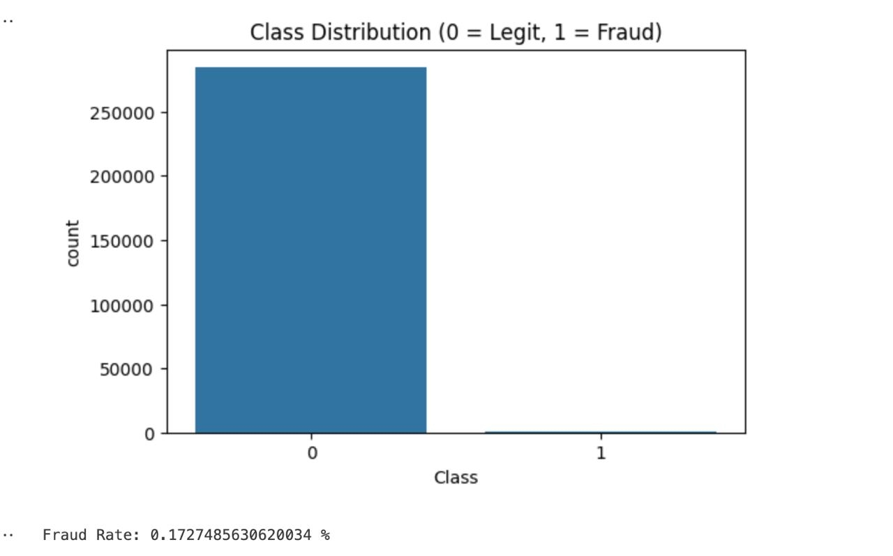

### Transaction Timing

```{python}
plt.figure(figsize=(8, 4))
plt.hist(df["Time"], bins=50, color="teal")
plt.title("Distribution of Transactions Over Time")
plt.xlabel("Time (seconds)")
plt.ylabel("Frequency")
plt.show()
```

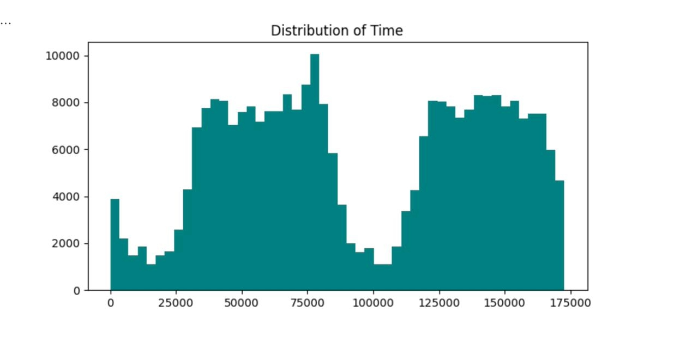

Transactions cluster into two distinct peaks, consistent with daily business-hour patterns across the two-day window. Fraud activity may cluster at specific hours, making `Time` a potentially informative feature.

### Transaction Amount

```{python}
plt.figure(figsize=(8, 4))
plt.hist(df["Amount"], bins=50, color="purple")
plt.title("Transaction Amount Distribution")
plt.xlabel("Amount (€)")
plt.ylabel("Frequency")
plt.show()
```

The amount distribution is heavily right-skewed — most transactions are small, with a long tail of larger amounts. This motivates scaling `Amount` with a `RobustScaler` (less sensitive to outliers than `StandardScaler`).

### Correlation with Fraud

```{python}
corr = df.corr()
ct = corr[["Class", "Time"]]
threshold = 0.2
high_corr = ct[ct.abs().max(axis=1) > threshold]
high_corr.sort_values(by="Class", key=lambda x: x.abs(), ascending=False)
```

```
          Class      Time
Class  1.000000 -0.012323
V17   -0.326481 -0.073297
V14   -0.302544 -0.098757
V12   -0.260593  0.124348
V10   -0.216883  0.030617
V3    -0.192961 -0.419618
```

**V17** is the single PCA component most correlated with fraud (r = −0.33). Even though 0.33 sounds modest, given the class imbalance, a correlation of this magnitude is quite meaningful. Most high-signal components are *negatively* correlated with fraud — very negative values of V17, V14, and V12 are a warning sign.

```{python}
plt.figure(figsize=(12, 10))
sns.heatmap(df.corr(), cmap="coolwarm", center=0)
plt.title("Correlation Matrix")
plt.show()
```

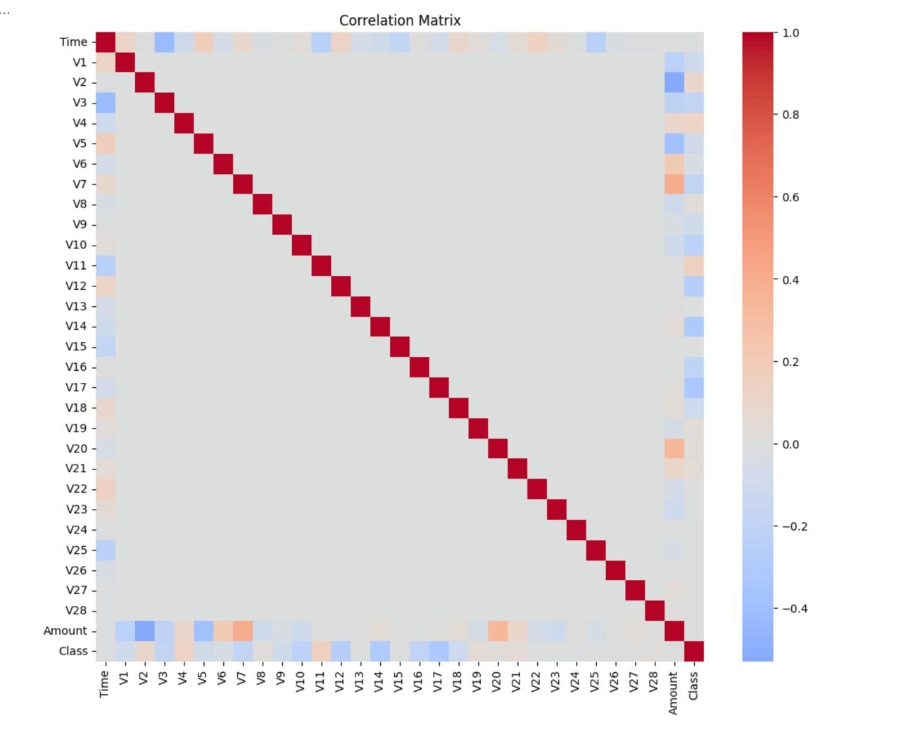

### Amount by Class

```{python}
plt.figure(figsize=(8, 5))
sns.boxplot(x="Class", y="Amount", data=df, palette="Set2")
plt.ylim(0, 500)
plt.title("Transaction Amount by Class (Fraud vs. Legitimate)")
plt.show()
```

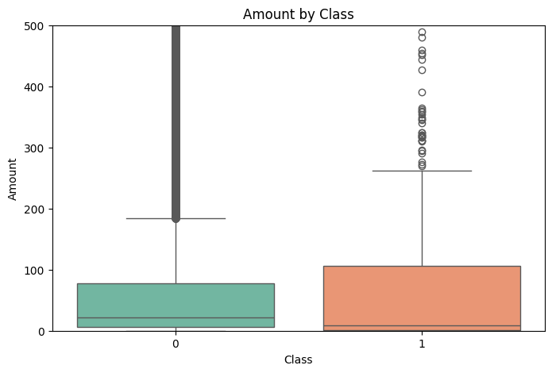

### PCA Visualization

```{python}
from sklearn.decomposition import PCA

X = df.drop("Class", axis=1)
pca = PCA(n_components=2)
pca_comp = pca.fit_transform(X)

plt.figure(figsize=(8, 6))
plt.scatter(pca_comp[:, 0], pca_comp[:, 1], c=df["Class"], cmap="coolwarm", s=2)
plt.title("PCA Projection: Fraud (red) vs. Normal (blue)")
plt.show()
```

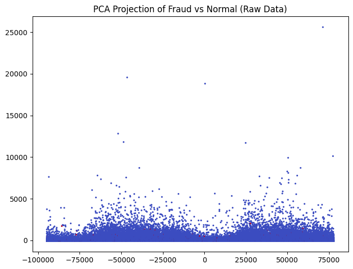

The PCA plot confirms that fraud cannot be separated by a simple rule. Fraudulent transactions (red) are scattered throughout the normal transaction cloud — this is why we need probabilistic models that learn subtle, high-dimensional patterns.

---

## Data Preprocessing

Before modeling, we standardize `Amount` and `Time` (the PCA features V1–V28 are already standardized), then split into train/test sets, and finally apply **random undersampling** to balance the training data.

```{python}
from sklearn.preprocessing import RobustScaler
from sklearn.model_selection import train_test_split
from imblearn.under_sampling import RandomUnderSampler

# Scale Amount and Time
rob_scaler = RobustScaler()
df["scaled_amount"] = rob_scaler.fit_transform(df["Amount"].values.reshape(-1, 1))
df["scaled_time"] = rob_scaler.fit_transform(df["Time"].values.reshape(-1, 1))
df = df.drop(["Amount", "Time"], axis=1)

X = df.drop("Class", axis=1)
y = df["Class"]

# 80/20 stratified split
X_train, X_test, y_train, y_test = train_test_split(
    X, y, test_size=0.2, stratify=y, random_state=42
)

# Undersample the training set to 50/50 fraud/non-fraud
rus = RandomUnderSampler(random_state=42)
X_train_res, y_train_res = rus.fit_resample(X_train, y_train)

print(f"Training set after undersampling: {X_train_res.shape}")
print(f"Class balance: {y_train_res.value_counts().to_dict()}")
```

**Why undersample?** Without rebalancing, a model trained on 99.83% non-fraud data learns that the safest prediction is always "not fraud." By reducing the non-fraud training examples to match the fraud count, we force the model to actually learn what distinguishes fraud. Crucially, we **do not** modify the test set — it retains the real-world 0.17% fraud rate so our evaluation reflects actual deployment conditions.

---

## Model 1: Logistic Regression

Logistic Regression models the *probability* of fraud as a sigmoid function of a linear combination of features. It's a natural starting point for binary classification.

```{python}
from imblearn.pipeline import Pipeline
from sklearn.preprocessing import StandardScaler
from sklearn.linear_model import LogisticRegression
from sklearn.metrics import (
    classification_report, confusion_matrix,
    roc_auc_score, precision_recall_curve, average_precision_score,
    roc_curve
)

pipe = Pipeline(steps=[
    ("scale", StandardScaler()),
    ("clf", LogisticRegression(max_iter=1000))
])

pipe.fit(X_train_res, y_train_res)

y_pred = pipe.predict(X_test)
y_proba = pipe.predict_proba(X_test)[:, 1]
```

### Results

```
Confusion Matrix:
[[55462  1402]
 [    8    90]]

Classification Report (Class 1 = Fraud):
              precision    recall  f1-score
           0     0.9999    0.9753    0.9874
           1     0.0603    0.9184    0.1132

ROC AUC:  0.9759
PR AUC:   0.6499
```

**Interpreting the numbers:**

- **Recall = 91.8%** — the model catches 90 of the 98 fraudulent transactions. Very good.
- **Precision = 6.0%** — of all flagged transactions, only 6% are actually fraud (1,402 false positives).
- **ROC AUC = 0.976** — the model ranks fraud above non-fraud 97.6% of the time. Excellent discrimination.
- **PR AUC = 0.650** — the precision-recall tradeoff tells a harder story, reflecting the difficulty of the imbalance.

The high false positive rate is a direct consequence of the class imbalance: even a small false-positive *rate* translates to thousands of mis-flagged legitimate transactions.

### Confusion Matrix

```{python}
cm = confusion_matrix(y_test, y_pred)
plt.figure(figsize=(5, 4))
sns.heatmap(cm, annot=True, fmt="d", cmap="Blues",
            xticklabels=["Predicted 0", "Predicted 1"],
            yticklabels=["Actual 0", "Actual 1"])
plt.title("Confusion Matrix – Logistic Regression")
plt.tight_layout()
plt.show()
```

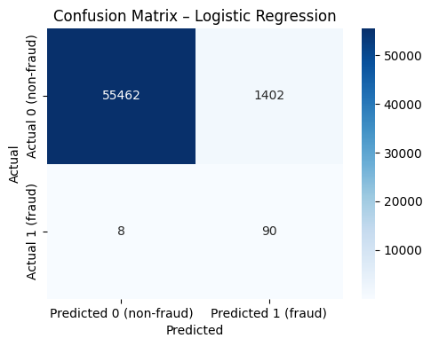

### ROC Curve

```{python}
fpr, tpr, _ = roc_curve(y_test, y_proba)
roc_auc = roc_auc_score(y_test, y_proba)

plt.figure(figsize=(5, 4))
plt.plot(fpr, tpr, label=f"AUC = {roc_auc:.3f}")
plt.plot([0, 1], [0, 1], linestyle="--", label="Random model")
plt.xlabel("False Positive Rate")
plt.ylabel("True Positive Rate (Recall)")
plt.title("ROC Curve – Logistic Regression")
plt.legend()
plt.tight_layout()
plt.show()
```

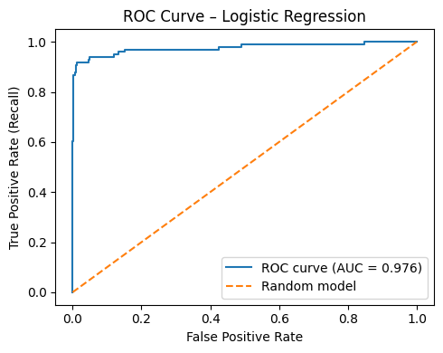

### Precision–Recall Curve

```{python}
precision, recall, _ = precision_recall_curve(y_test, y_proba)
pr_auc = average_precision_score(y_test, y_proba)

plt.figure(figsize=(5, 4))
plt.plot(recall, precision, label=f"AP = {pr_auc:.3f}")
plt.xlabel("Recall")
plt.ylabel("Precision")
plt.title("Precision–Recall Curve – Logistic Regression")
plt.legend()
plt.tight_layout()
plt.show()
```

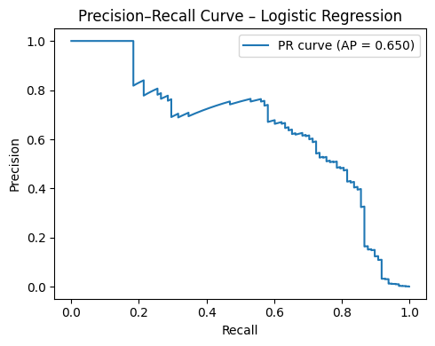

The PR curve is more informative than the ROC curve for imbalanced problems because it focuses on the minority class. The steep drop-off shows the fundamental tradeoff a bank faces: catching more fraud inevitably means more false alarms.

### Predicted Fraud Probability Distribution

```{python}
import pandas as pd
proba_df = pd.DataFrame({"prob": y_proba, "Class": y_test.values})

plt.figure(figsize=(8, 5))
sns.kdeplot(data=proba_df[proba_df["Class"] == 0]["prob"], fill=True, alpha=0.4, label="Non-fraud")
sns.kdeplot(data=proba_df[proba_df["Class"] == 1]["prob"], fill=True, alpha=0.6, label="Fraud")
plt.title("Predicted Fraud Probability Distributions – Logistic Regression")
plt.xlabel("Predicted Probability of Fraud")
plt.ylabel("Density")
plt.legend()
plt.tight_layout()
plt.show()
```

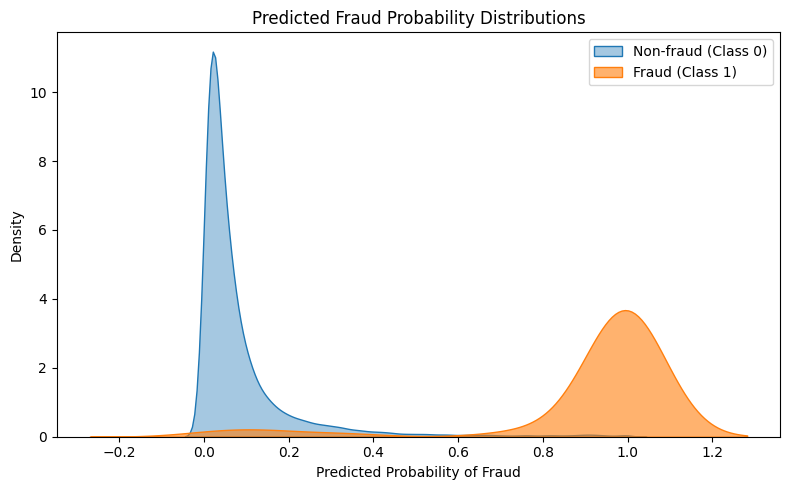

---

## Model 2: Decision Tree

A Decision Tree makes predictions by learning a hierarchy of simple if/else rules on the feature values. We use `max_depth=6` to prevent overfitting.

```{python}
from sklearn.tree import DecisionTreeClassifier

tree = DecisionTreeClassifier(max_depth=6, random_state=42)
tree.fit(X_train_res, y_train_res)

y_pred_dt = tree.predict(X_test)
y_proba_dt = tree.predict_proba(X_test)[:, 1]
```

### Results

```
Confusion Matrix:
[[52163  4701]
 [   10    88]]

Classification Report:
              precision    recall  f1-score
           0     1.00      0.92      0.96
           1     0.02      0.90      0.04

ROC AUC:  0.908
```

The Decision Tree achieves **90% recall** (catches 88/98 frauds) — slightly lower than Logistic Regression — but generates far more false positives (4,701 vs. 1,402). Its ROC AUC of 0.908 is also lower.

### Confusion Matrix

```{python}
cm_dt = confusion_matrix(y_test, y_pred_dt)
plt.figure(figsize=(6, 5))
sns.heatmap(cm_dt, annot=True, fmt="d", cmap="Reds", cbar=True)
plt.title("Confusion Matrix – Decision Tree")
plt.xlabel("Predicted Label")
plt.ylabel("True Label")
plt.show()
```

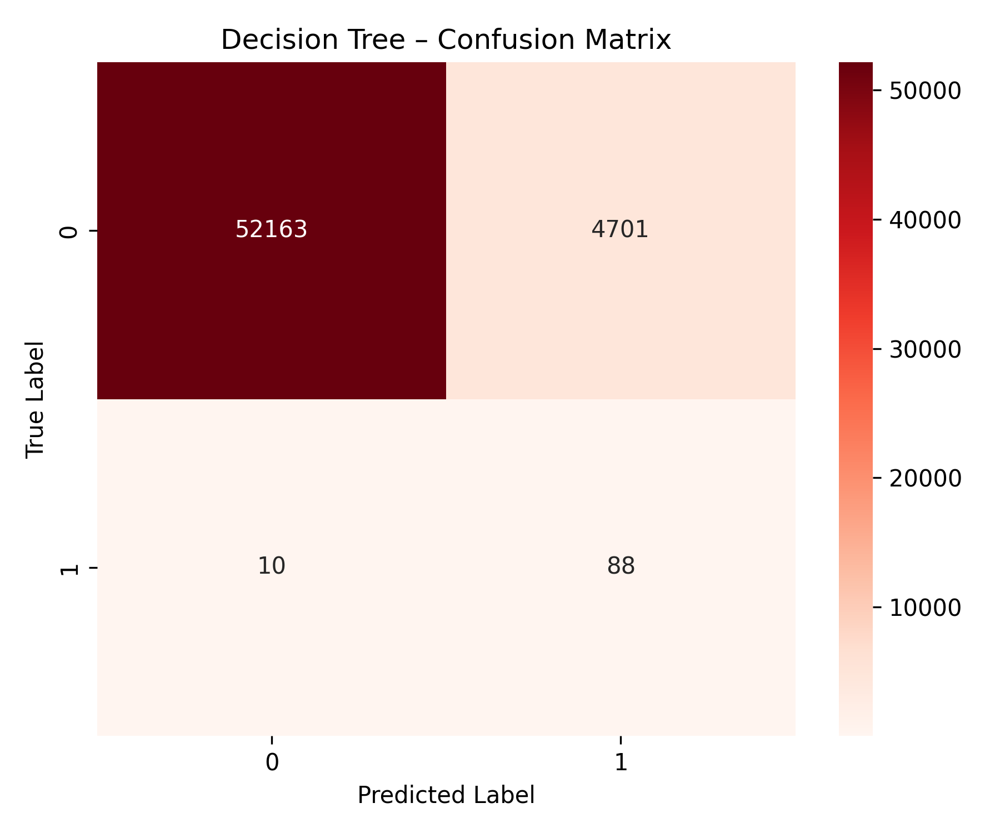

### Feature Importance

Unlike Logistic Regression, a Decision Tree provides direct feature importance scores — a useful diagnostic.

```{python}
importances = tree.feature_importances_
indices = np.argsort(importances)[::-1]
features = X_test.columns

plt.figure(figsize=(10, 6))
sns.barplot(x=importances[indices][:10], y=features[indices][:10], palette="Reds_r")
plt.title("Feature Importance – Decision Tree (Top 10)")
plt.xlabel("Importance Score")
plt.ylabel("Feature")
plt.tight_layout()
plt.show()
```

The top features align with our EDA findings: V14, V17, V12, and V10 — the components most correlated with fraud — drive most of the tree's decisions.

### ROC and PR Curves

```{python}
fpr_dt, tpr_dt, _ = roc_curve(y_test, y_proba_dt)
roc_auc_dt = auc(fpr_dt, tpr_dt)

plt.figure(figsize=(8, 6))
plt.plot(fpr_dt, tpr_dt, label=f"AUC = {roc_auc_dt:.3f}")
plt.plot([0, 1], [0, 1], "k--", color="orange", label="Random model")
plt.title("ROC Curve – Decision Tree")
plt.xlabel("False Positive Rate")
plt.ylabel("True Positive Rate")
plt.legend()
plt.grid(True)
plt.show()
```

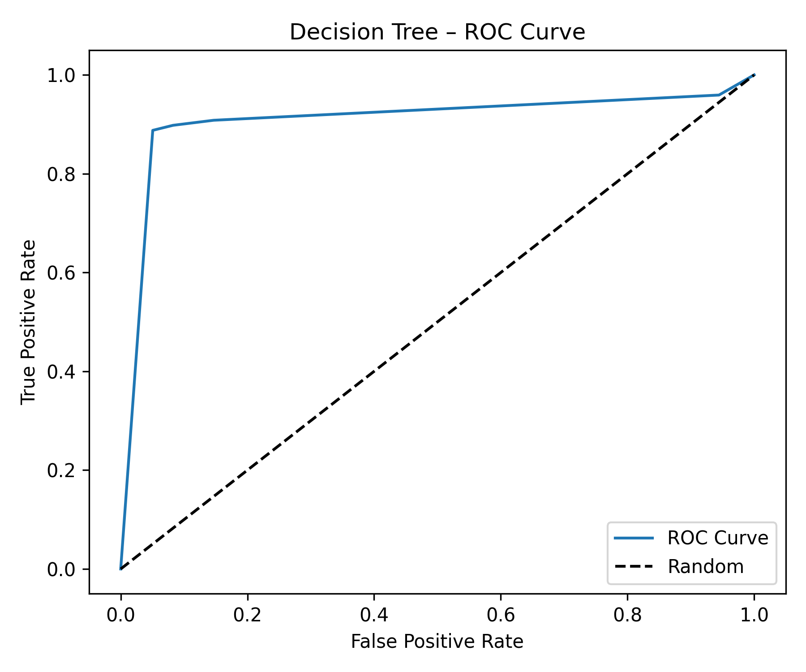

```{python}
precision_dt, recall_dt, _ = precision_recall_curve(y_test, y_proba_dt)
plt.plot(recall_dt, precision_dt)
plt.title("Precision–Recall Curve – Decision Tree")
plt.xlabel("Recall")
plt.ylabel("Precision")
plt.grid(True)
plt.show()
```

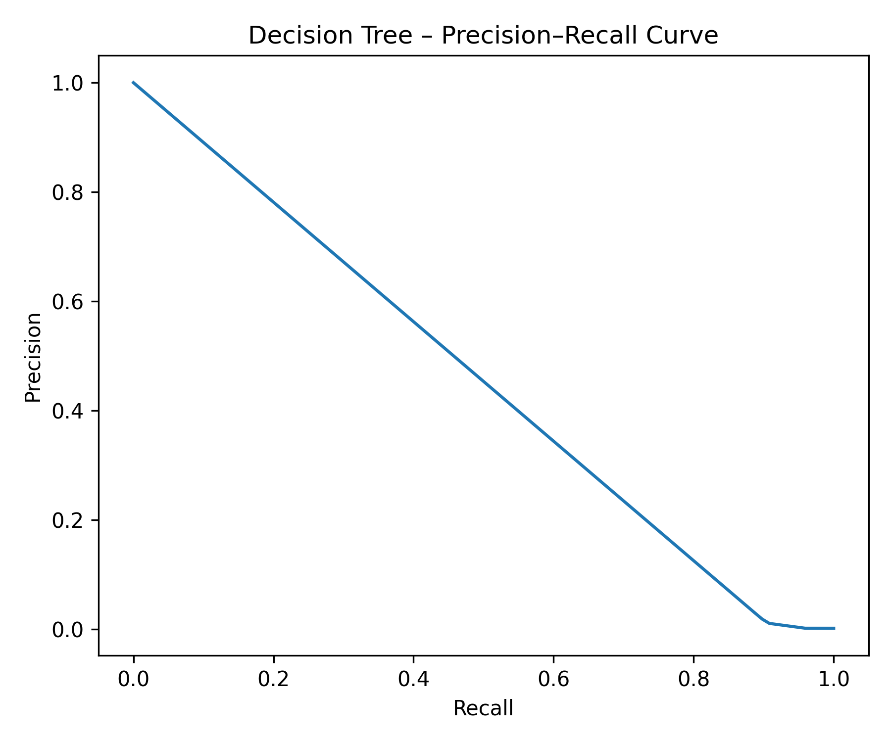

---

## Model Comparison

| Metric | Logistic Regression | Decision Tree |
|:-------|--------------------:|-------------:|
| Recall (fraud) | **91.8%** | 89.8% |
| Precision (fraud) | 6.0% | 1.8% |
| False Positives | **1,402** | 4,701 |
| ROC AUC | **0.976** | 0.908 |
| PR AUC | **0.650** | lower |

**Logistic Regression outperforms the Decision Tree on every dimension** for this problem.

The key reasons:

1. **Smoother probability estimates.** Logistic Regression produces calibrated, smooth probability scores. Decision Trees produce bimodal, poorly calibrated probabilities — many fraud cases are either very confidently identified or very confidently missed, with little in between.

2. **Better generalization.** Decision Trees easily overfit, especially on imbalanced undersampled data. Even with `max_depth=6`, the tree generates 3× more false positives.

3. **Linear separability in PCA space.** Since PCA components are designed to be uncorrelated and capture maximum variance, the fraud signal is partially captured by linear combinations of these components — exactly what Logistic Regression is built to exploit.

---

## Key Takeaways

1. **Accuracy is misleading for imbalanced data.** Always report Recall, Precision, and AUC — not just accuracy.

2. **Random undersampling is a practical fix.** By training on a balanced 50/50 subset, both models learn to distinguish fraud instead of always predicting the majority class. The test set remains imbalanced to reflect real conditions.

3. **High recall at the cost of precision is often the right call for fraud.** Catching 90%+ of fraud, even at the cost of flagging some legitimate transactions, may be worth it if undetected fraud is expensive. The bank decides the threshold based on its cost structure.

4. **Logistic Regression is a strong baseline.** Before reaching for complex models (Random Forest, XGBoost, neural networks), a well-tuned Logistic Regression with proper preprocessing often performs surprisingly well.
